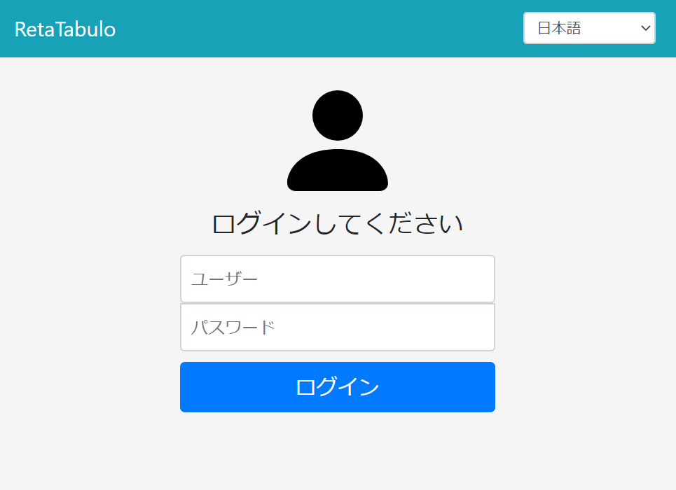
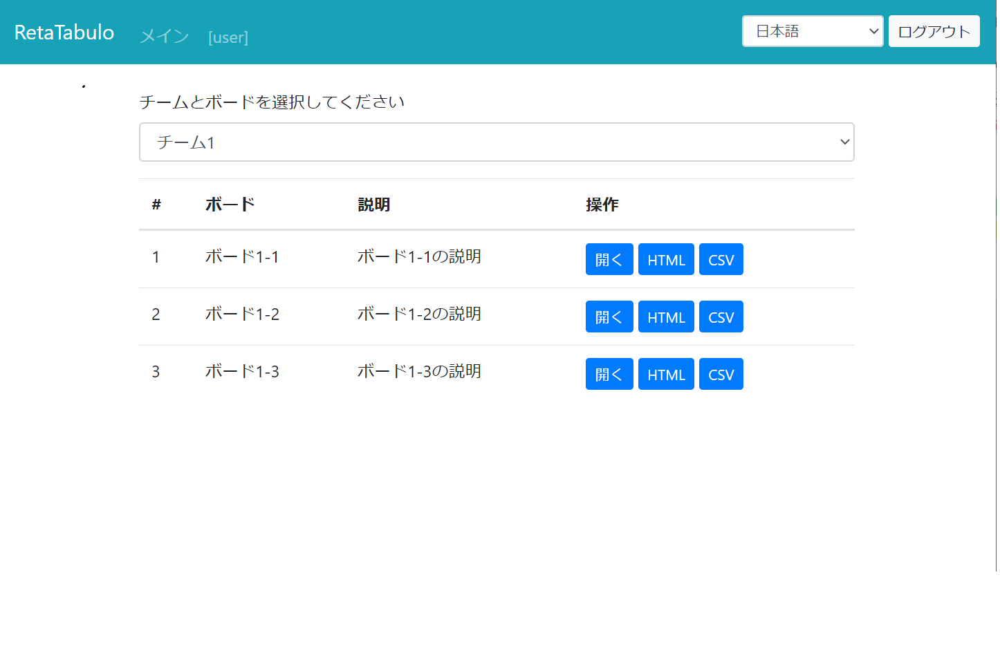
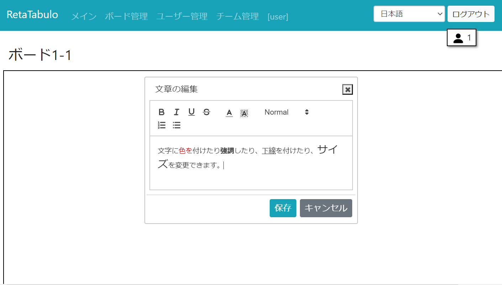
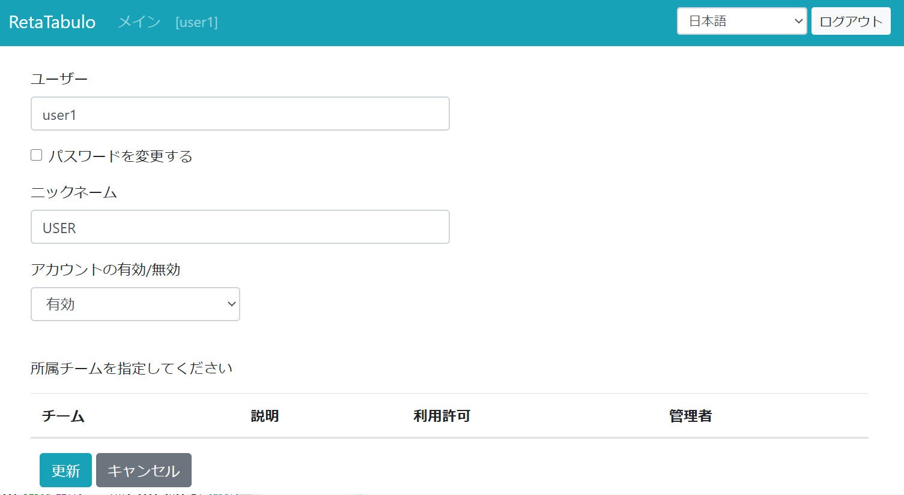
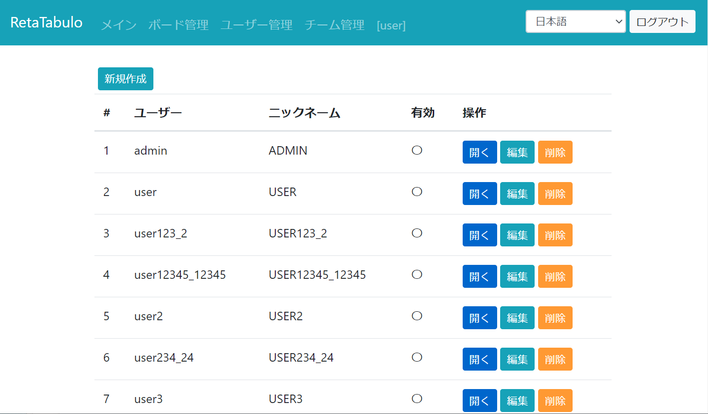
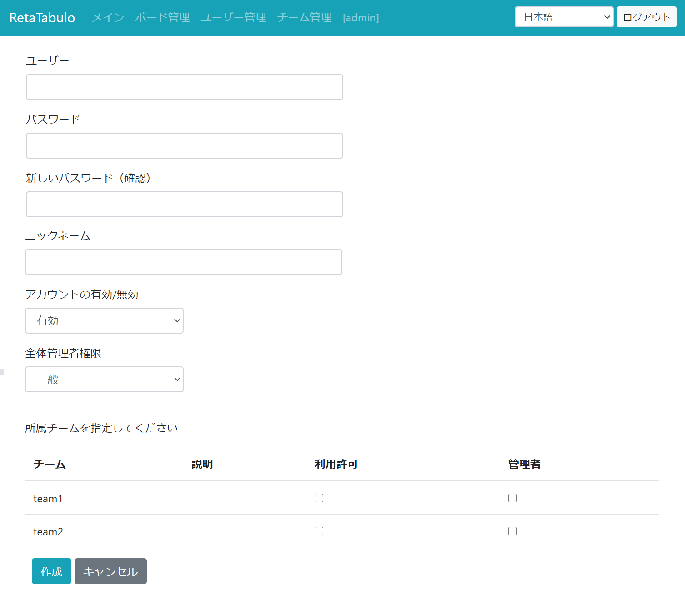
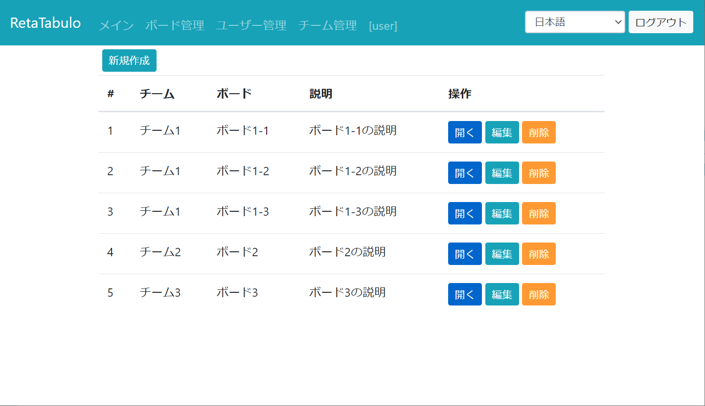
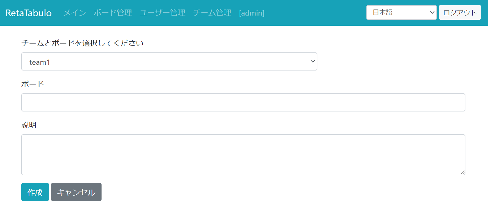
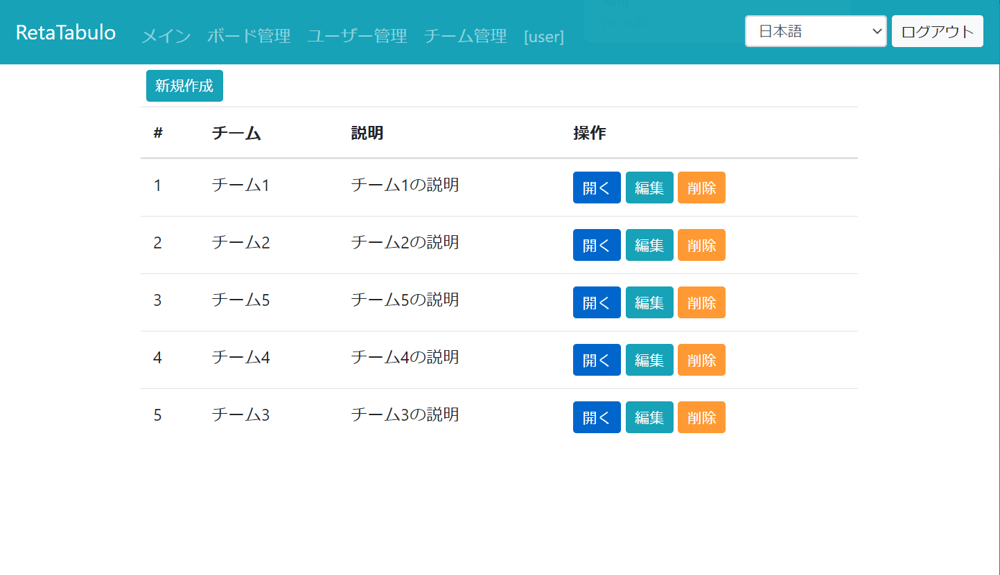
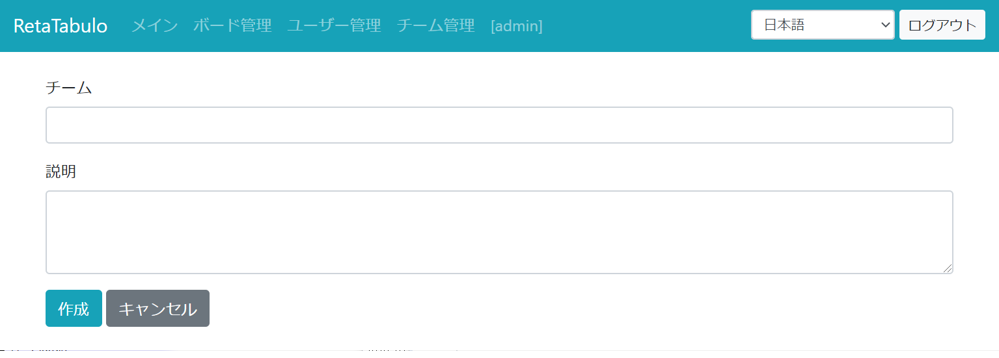

# RetaTabulo

- README en Esperanto estas en preparado.
- README in English is in preparation.

### Overview

- RetaTabulo is a online white board application.
- The application provides white boards, on which the users can write, remove and move phrases.
- The content of a board is shared with all the users on the board.
- The administrators can create, modify and remove boards and users.
- Each user belongs to one or more teams. Users can use only boards belonging to their own teams.
- Users can change the language by selecting a language in a pulldown in the header (Japanese, Esperanto and English are available). RetaTabulo means "net board" in Esperanto.

> The internationalization is not yet complete. Some messages are not properly displayed in the selected language.

### 概要

- RetaTabuloはオンラインホワイトボード共有アプリケーションです。
- ホワイトボードを表示し、文章を書き込んだり、削除したり、移動することができます。
- ボードの表示内容は、同じボードにアクセスしているユーザーと同期されます。
- 管理者は、ボードやユーザーを作成・編集・削除することができます。
- RetaTabuloにはチームという概念があります。チームに属するユーザーのみ、チーム内のボードにアクセスすることができます。
- 画面右上のプルダウンから表示言語を選択できます（日本語、エスペラント、英語）。（RetaTabulo（れーたたぶーろ）はエスペラントで、ネットボードの意味です。）

> 現段階で国際化は未完成です。一部のメッセージが選択した言語で表示されません。

### 基本的な使い方

1. ユーザー名・パスワードを利用してログインします。



2. メイン画面で自分が属しているチームとチーム内のボードを選択し、「開く」を押下します。



3. ボード画面が表示されるので文の作成・削除などを行います。

### ボード画面での操作

ここではボード画面での操作方法を説明します。
パソコン上での操作を中心に説明します。タブレットやスマホをご利用の場合は、
ダブルクリックと書かれている個所で、長押し（タップ＆ホールド）を行ってください。<br>
<br>
ボードタイトル横の情報表示チェックボックスをチェックすると、文章を作成したユーザー名/最後に編集したユーザー名が表示されます。

>ボード画面の機能は今後拡張予定です。

**文章の作成**

ボード上でダブルクリック、あるいは、右クリックメニューで「作成」ボタンを押下します。
「文章の編集」ダイアログが表示されので、文章を記載し「保存」ボタンを押下します。

**文章の編集**

編集したい文章上でダブルクリック、あるいは、右クリックメニューで「編集」ボタンを押下します。
「文章の編集」ダイアログが表示されるので、適宜変更して「保存」ボタンを押下します。


**文字の装飾**

文字列を選択した状態で、「文章の編集」ダイアログ上部の装飾ボタンを押下することで、下記の装飾を行うことができます：
- 太文字
- イタリック
- 下線
- 取り消し線
- 文字色
- 背景色
- 文字サイズ
- リスト

**文章の削除**

文章を削除する場合、削除したい文章を選択して削除キーを押下、
もしくは、右クリックメニュで「削除」ボタンを押下する。

**文章の移動**

ドラッグすることで文章を移動することができます。

**文章のコピー**

コピーしたい文章上で、右クリックメニューを表示し、「コピー」ボタンを押下します。

**ボード利用者情報**

ボード画面の右上には、ボードを利用しているユーザーの人数（縮小表示時）、もしくは、
ユーザー名リスト（通常表示時）が表示されます。初期状態は縮小表示状態で、クリックによって、
縮小表示と通常表示が切り替わります。
ユーザー名の末尾の括弧内の文字列は、同じユーザー名（アカウント）ログインした利用者を識別する文字列です。



### メイン画面での操作

**ユーザー情報変更**

1. ユーザー情報（ユーザー名やパスワード）を変更したい場合には、画面上部のユーザー名をクリックします。
2. ユーザー情報編集画面が表示されるので変更したい項目を変更してください。
  パスワードを変更する場合には、「パスワードを変更する」をチェックし、
  現在のパスワード、新パスワード、新パスワード（確認）を入力します。

3. 変更を確定する場合「更新」ボタンを押下します。変更を取り消す場合には「キャンセル」ボタンを押下します。



**ボード情報保存（HTML)**

「HTML」ボタンを押すと、ボード画面をHTMLとしてダウンロードすることができます。

**ボード情報保存（CSV)**

「CSV」ボタンを押すと、ボード画面データをダウンロードすることができます。
> 現在のところこのデータをインポートする機能はありません。

---
# 機能の詳しい説明

ここからは、全体管理者とチーム管理者が利用できる機能を説明します。<br>
**一般ユーザーとして利用される方は、お読みになる必要はありません。**

## 役割と権限
本アプリケーションには以下の役割（ロール）が存在します。

<table border="1" style="border: solid 1px #000000;border-collapse: collapse;" >
<tr style="background-color:#dff">
<th style="width:5%">No.</th>
<th style="width:25%">役割</th>
<th style="width:70%">説明</th>
</tr>
<tr>
<td>1</td>
<td>全体管理者</td>
<td>すべての操作を行うことができます。</td></tr>
<tr>
<td>2</td>
<td>チーム管理者</td>
<td>管理対象チームに属するボードやユーザーを作成・変更・削除することができます。
全体管理者のみがチーム管理者を作成できます。複数チームに対して管理権限を持つ場合があります。</td>
</tr>
<tr>
<td>3</td>
<td>一般ユーザー</td>
<td>自分が所属するチームのボードのみ利用可能です。
自分自身のユーザー情報を変更することができます。
複数チームに属する場合があります。</td>
</tr>
</table>


## 機能一覧

<table border="1" style="border: solid 1px #000000;border-collapse: collapse;" >
<tr style="background-color:#dff">
<th style="width:5%">No.</th>
<th style="width:20%">機能</th>
<th style="width:25%">全体管理者</th>
<th style="width:25%">チーム管理者</th>
<th style="width:25%">一般ユーザー</th>
</tr>
<tr><td>1</td><td>ログイン/ログアウト</td><td>○</td><td>○</td><td>○</td></tr>
<tr><td>2</td><td>ボード利用</td><td>○（すべて）</td><td>○（自チームのみ）</td><td>○（自チームのみ）</td></tr>
<tr><td>3</td><td>ボード情報保存（HTML）</td><td>○（すべて）</td><td>○（自チームのみ）</td><td>○（自チームのみ）</td></tr>
<tr><td>4</td><td>ボード情報保存（CSV）</td><td>○（すべて）</td><td>○（自チームのみ）</td><td>○（自チームのみ）</td></tr>
<tr><td>5</td><td>ボード一覧表示</td><td>○（すべて）</td><td>○（管理対象チームのみ）</td><td>×</td></tr>
<tr><td>6</td><td>ボード情報表示</td><td>○（すべて）</td><td>○（管理対象チームのみ）</td><td>×</td></tr>
<tr><td>7</td><td>ボード作成</td><td>○（すべて）</td><td>○（管理対象チームのみ）</td><td>×</td></tr>
<tr><td>8</td><td>ボード編集</td><td>○（すべて）</td><td>○（管理対象チームのみ）</td><td>×</td></tr>
<tr><td>9</td><td>ボード削除</td><td>○（すべて）</td><td>○（管理対象チームのみ）</td><td>×</td></tr>
<tr><td>10</td><td>ユーザー一覧表示</td><td>○（すべて）</td><td>○（管理対象チームのみ）</td><td>×</td></tr>
<tr><td>11</td><td>ユーザー情報表示</td><td>○（すべて）</td><td>○（管理対象チームのみ）</td><td>○（自分のみ）</td></tr>
<tr><td>12</td><td>ユーザー作成</td><td>○（すべて）<br>全体管理者のみ全体管理者者の作成が可能です。</td><td>○（管理対象チームのユーザーのみ作成可能）</td><td>×</td></tr>
<tr><td>13</td><td>ユーザー編集</td><td>○（すべて）</td><td>○（管理対象チームの一般ユーザーのみ編集可能。ただし、チーム管理者の編集は不可）</td><td>○（自分のみ）</td></tr>
<tr><td>14</td><td>ユーザー削除</td><td>○（すべて）</td><td>○（管理対象チームのユーザーのみ削除可能）</td><td>×</td></tr>
<tr><td>15</td><td>チーム一覧表示</td><td>○（すべて）</td><td>○（管理対象チームのみ）</td><td>×</td></tr>
<tr><td>16</td><td>チーム情報表示</td><td>○（すべて）</td><td>×</td><td>×</td></tr>
<tr><td>17</td><td>チーム作成</td><td>○（すべて）</td><td>×</td><td>×</td></tr>
<tr><td>18</td><td>チーム編集</td><td>○（すべて）</td><td>×</td><td>×</td></tr>
<tr><td>19</td><td>チーム削除</td><td>○（すべて）</td><td>×</td><td>×</td></tr>
</table>

※ユーザーが複数チームに属する場合の説明<br>
あるユーザーがＡチームの管理権限をもち（すなわち、Ａチームのチーム管理者）、Ｂチームの一般ユーザーである場合もある。
この場合、Ａチームに属するボードを作成できるが、Ｂチームのボードの作成はできない。
しかし、Ａ，Ｂ両チームのボードを利用することはできる。

## ユーザー関連の操作

### ユーザー一覧

画面上部のメニューで「ユーザー管理」をクリックすると、ユーザー一覧画面が表示されます。
操作したいユーザーの右にあるボタンをクリックすることで、

- ユーザー情報画面の表示（「開く」ボタン）、
- ユーザー情報編集画面の表示（「編集」ボタン）、
- ユーザーの削除（「削除」ボタン）

を行うことができます。



### ユーザー作成
一覧画面上部にある「新規作成」ボタンを押すと、ユーザー作成画面が表示されます。<br>
下記項目を入力し、作成ボタンを押下してください。


<br><br>

<table border="1" style="border: solid 1px #000000;border-collapse: collapse;" >
<tr style="background-color:#dff">
<th style="width:5%">No.</th>
<th style="width:20%">項目名</th>
<th style="width:25%">入力値</th>
<th style="width:55%">説明</th>
</tr>
<tr>
<td>1</td>
<td>ユーザー名</td>
<td>・入力必須<br>
・4～16文字<br>
・利用可能文字：<br>
「a-zA-Z0-9_.-」
</td>
<td>ユーザー名を入力してください。入力したユーザー名が既に登録されている場合には、
「作成」ボタン押下時に名称変更を促すメッセージが表示されます。</td>
</tr>
<tr>
<td>2</td>
<td>パスワード</td>
<td>・入力必須<br>
・8～20文字<br>
・利用可能文字<br>
「!\"#$%&'()*+,./0123456789:;<=>?@ABCDEFGHIJKLMNOPQRSTUVWXYZ\[]^_`abcdefghijklmnopqrstuvwxyz{|}~-」
</td>
<td>パスワード</td>
</tr>
<tr>
<td>3</td>
<td>新しいパスワード（確認）</td>
<td>上記、パスワードと同じ</td>
<td>確認のためパスワード欄に入力したものと同じパスワードを入力してください。</td>
</tr>
<tr>
<td>4</td>
<td>ニックネーム</td>
<td>
・入力必須<br>
・1～20文字</td>
<td>
ユーザーのニックネームを設定してください。<br>
(現段階で、ニックネームを利用している個所はありませんが、将来的に利用したいと考えています。)
</td>
</tr>
<tr>
<td>5</td>
<td>アカウントの有効/無効</td>
<td>「有効」「無効」</td>
<td>ユーザを一時的にログインできない状態にしたい場合には「無効」を指定してください。</td>
</tr>
<tr>
<td>6</td>
<td>全体管理者権限</td>
<td>「一般」「全体管理者」</td>
<td>（全体管理者のみ設定可能）<br>作成するユーザーを全体管理者にしたい場合には「全体管理者」を設定してください。</td>
</tr>
<tr>
<td>7</td><td>所属チーム指定<br>（利用許可）</td>
<td>チェックボックス</td>
<td>（管理対象チームに対してのみ設定可能）<br>
利用を許可するチームを指定してください。</td>
</tr>
<tr>
<td>8</td>
<td>所属チーム指定<br>（管理者）</td>
<td>チェックボックス</td>
<td>（全体管理者のみ設定可能）<br>
管理者権限を付与するチームを指定してください。
ユーザーはチェックしたチームに対するチーム管理者になります。
「管理者」チェックボックスをチェックすると
自動的に「利用許可」チェックボックスがチェックされます。</td>
</tr>
</table>

### ユーザー編集
「ユーザー作成」画面と同様の画面が表示されます。<br>
変更したい項目を修正し、「更新」ボタンを押下してください。
パスワードの変更を行う場合には、「パスワードを変更する」チェックボックスをチェックし、
パスワードとパスワード（確認）を入力してください。<br><br>
自分自身のパスワードを変更する場合には、現在のパスワードの入力が必要です。

### ユーザー削除
ユーザー一覧画面で削除したいユーザーの「削除」ボタンを押下します。<br>
画面に削除確認ダイアログが表示され、「ＯＫ］を押下すると削除が実行されます。

## ボード関連の操作

画面上部のメニューで「ボード管理」をクリックすると、ボード一覧画面が表示されます。
操作したいボードの右にあるボタンをクリックすることで、

- ボード情報画面の表示（「開く」ボタン）、
- ボード情報編集画面の表示（「編集」ボタン）、
- ボードの削除（「削除」ボタン）

を行うことができます。




### ボード作成
一覧画面上部にある「新規作成」ボタンを押すと、ボード作成画面が表示されます。<br>
下記項目を入力し、作成ボタンを押下してください。


<br><br>

<table border="1" style="border: solid 1px #000000;border-collapse: collapse;" >
<tr style="background-color:#dff">
<th style="width:5%">No.</th>
<th style="width:20%">項目名</th>
<th style="width:25%">入力値</th>
<th style="width:55%">説明</th>
</tr>
<tr>
<td>1</td>
<td>チーム選択</td>
<td>プルダウン</td>
<td>ログインユーザーが管理権限を持っているチームが表示されます。
作成するボードを所有するチームを選択してください。
</td>
</tr>
<tr>
<td>2</td>
<td>ボード</td>
<td>・入力必須<br>
・3～30文字</td>
<td>名称を入力してください。
</td>
</tr>
<tr>
<td>3</td>
<td>説明</td>
<td>・100文字以下</td>
<td>説明を入力してください。
</td>
</tr>
</table>

### ボード編集
「ボード作成」画面と同様の画面が表示されます。<br>
変更したい項目を修正し、「更新」ボタンを押下してください。

### ボード情報表示
ボードー一覧画面で対象ボードの「開く」ボタンを押下します。

### ボード削除
ボードー一覧画面で削除したいボードの「削除」ボタンを押下します。<br>
画面に削除確認ダイアログが表示され、「ＯＫ］を押下すると削除が実行されます。


## チーム関連の操作
画面上部のメニューで「チーム管理」をクリックすると、チーム一覧画面が表示されます。
操作したいチームの右にあるボタンをクリックすることで、

- チーム情報画面の表示（「開く」ボタン）、
- チーム情報編集画面の表示（「編集」ボタン）、
- チームの削除（「削除」ボタン）

を行うことができます。




### チーム作成
一覧画面上部にある「新規作成」ボタンを押すと、チーム作成画面が表示されます。<br>
下記項目を入力し、作成ボタンを押下してください。


<br><br>

<table border="1" style="border: solid 1px #000000;border-collapse: collapse;" >
<tr style="background-color:#dff">
<th style="width:5%">No.</th>
<th style="width:20%">項目名</th>
<th style="width:25%">入力値</th>
<th style="width:55%">説明</th>
</tr>
<tr>
<td>1</td>
<td>チーム</td>
<td>・入力必須<br>
・3～30文字</td>
<td>名称を入力してください。
</td>
</tr>
<tr>
<td>2</td>
<td>説明</td>
<td>・100文字以下</td>
<td>説明を入力してください。
</td>
</tr>
</table>

### チーム編集
「チーム作成」画面と同様の画面が表示されます。<br>
変更したい項目を修正し、「更新」ボタンを押下してください。

### チーム情報表示
チーム一覧画面で対象ボードの「開く」ボタンを押下します。

### チーム削除
チーム一覧画面で削除したいチームの「削除」ボタンを押下します。<br>
画面に削除確認ダイアログが表示され、「ＯＫ］を押下すると削除が実行されます。

---

## インストール方法

ここからは、本アプリケーションのセットアップ方法を説明します。アプリを利用される方は方はお読みになる必要はありません。

### 前提条件
本アプリケーションは、SpringBootの埋め込み型Tomcatをアプリケーションサーバとして利用します。
Windows、Linuxにインストールすることが可能です。

稼働確認環境：
- Windows 10 Home 64bit (PostgreSQL 11)
- Amazon Linux AMI (PostgreSQL 9.6)

### DBセットアップ

PostgreSQLをインストールし、適宜データベースを作成してください。
作成したデータベースにRetaTabuloプロジェクトのsqlフォルダ内のcreate.sqlを実行して、
テーブルを作成してください。

### インストールディレクトリ作成
以下のディレクトリ階層を作成してください(Linŭを想定）。

<table border="1" style="border: solid 1px #000000;border-collapse: collapse;" >
<tr style="background-color:#dff">
<th style="width:5%">No.</th>
<th style="width:40%">パス</th>
<th style="width:55%">説明</th>
</tr>
<tr>
<td>1</td>
<td>tabulo-1.0.0.jar</td>
<td>jarファイル<br>
（maven package （テストはスキップ）で作成、もしくは、配布されたjarファイルを配備）
</td>
</tr>
<tr>
<td>2</td>
<td>config/application.properties</td>
<td>SpringBoot設定ファイル<br>
（config/application.propertiesをコピー）
</td>
</tr>
<tr>
<td>3</td>
<td>config/tabulo.properties</td>
<td>アプリケーション個別設定ファイル<br>
（config/tabulo.propertiesをコピー）</td>
</tr>
<tr>
<td>4</td>
<td>log</td>
<td>ログ出力フォルダ</td>
</tr>
</table>


### 定義ファイル修正

定義ファイル「application.properties」の（※）の個所をセットアップしたDB環境に合わせて修正してください。

### RetaTabulo起動

一時的に起動する場合には、

```
java -jar tabulo-1.0.0.jar
```

で実行可能です。

Linuxサーバ上で実行する場合には、serviceとして起動することを推奨します。
以下のようにinit.dにシンボリックリンクを張ることでサービスとして利用できます。<br>
（例）サービス名"tabulo"として登録する場合）

```
$ sudo ln -s （インストールディレクトリ）/tabulo-1.0.0.jar /etc/init.d/tabulo
```
サービスとして、起動や停止が可能です。<br>
ログがlog/tabulo.logに出力されます。必要に応じてご確認ください。


```
例）$ sudo service tabulo start
```

初期起動時にユーザーが存在しない場合、自動的に管理者ユーザーを作成します。<br>
作成した管理者情報はインストールフォルダ内の下記のファイルに記載されています（管理者情報ファイル）。

> インストールフォルダに起動ユーザーの書き込み権限がない場合、管理者情報ファイルの出力に失敗し、
管理ユーザーが作成されません。権限をご確認ください。

```
LoginInfo_（タイムスタンプ）
```

以下のURLからログイン画面を表示し、上記の管理者情報を使ってログインしてください。
ログイン後、必要に応じてユーザー名、パスワードを変更し、管理者情報ファイルを削除、
もしくは、安全な場所に移動してください。

```
http://localhost:8080/rt/app/login
```


### 定義ファイル

#### application.properties

<table border="1" style="border: solid 1px #000000;border-collapse: collapse;" >
<tr style="background-color:#dff">
<th style="width:5%">No.</th>
<th style="width:20%">項目名</th>
<th style="width:25%">入力値（例）</th>
<th style="width:55%">説明</th>
</tr>
<tr><td>1</td><td>server.servlet.session.timeout</td><td>60m</td><td>セッションタイムアウト時間</td></tr>
<tr><td>2</td><td>server.servlet.context-path</td><td>/rt/app</td><td>コンテキストパス</td></tr>
<tr><td>3</td><td>spring.jpa.database</td><td>POSTGRESQL</td><td>利用するDB種類</td></tr>
<tr><td>4</td><td>spring.datasource.url</td><td>jdbc:postgresql://localhost:5432/board2</td>
<td>（※）JDBC接続情報</td></tr>
<tr><td>5</td><td>spring.datasource.username</td><td>postgres</td><td>（※）DBユーザー名</td></tr>
<tr><td>6</td><td>spring.datasource.password</td><td>testtest1</td><td>（※）DBパスワード</td></tr>
<tr><td>7</td><td>logging.level.root</td><td>INFO</td><td>rootログレベル</td></tr>
<tr><td>8</td><td>logging.level.org.springframework.web</td><td>ERROR</td><td>webログレベル</td></tr>
<tr><td>9</td><td>logging.level.tabulo</td><td>DEBUG</td><td>RetaTabuloログレベル</td></tr>
<tr><td>10</td><td>logging.file</td><td>log/tabulo.log</td><td>ログ出力ファイルパス</td></tr>
<tr><td>11</td><td>spring.thymeleaf.cache </td><td> false</td><td>Thymeleafキャッシュ有無</td></tr>
<tr><td>12</td><td>spring.session.store-type</td><td>jdbc</td><td>セッションストアタイプ</td></tr>
<tr><td>13</td><td>server.port</td><td>コメントアウト</td><td>サーバポート番号。SpringBootアプリケーションのデフォルトポートは8080。変更したい場合にはコメントアウトを外して、値を設定する。</td></tr>
</table>

#### tabulo.properties

<table border="1" style="border: solid 1px #000000;border-collapse: collapse;" >
<tr style="background-color:#dff">
<th style="width:5%">No.</th>
<th style="width:20%">項目名</th>
<th style="width:20%">項目名</th>
<th style="width:10%">入力値</th>
<th style="width:45%">説明</th>
</tr>
<tr>
<td>1</td><td>tabulo.connectionCheckInterval</td>
<td>接続確認間隔</td>
<td>60</td>
<td>
（ボード画面でのWebSocket通信関連項目）<br>
この設定値（秒）ごとにブラウザのWebSocket接続が有効か否かを判定する。
接続が切れている場合には、再読み込みを促すダイアログを表示する。
また、ボード画面でなんらかの操作を行う際に、同様の接続チェックを行っている。</td>
</tr>
<tr>
<td>2</td>
<td>tabulo.sendBeaconInterval</td>
<td>ボード利用通知間隔</td>
<td>180</td>
<td>（ボード画面でのWebSocket通信関連項目）<br>
この設定値（秒）ごとにボードを利用していることをWebSocketでサーバに通知している（ボード利用通知）。
サーバ側はこの通知が途絶えてから一定の時間（ボード退出判定時間）が経過した場合に、
ボード利用者リストから当該利用者を削除する処理を行っている。
これは、ボード利用終了処理が行われずにボード利用が終了した際に、
ボード一覧に利用者が残らないようにするための処理である。</td>
</tr>
<tr>
<td>3</td>
<td>tabulo.thresholdPeriodInSeconds</td>
<td>ボード退出判定時間</td>
<td>400</td>
<td>（ボード画面でのWebSocket通信関連項目）<br>
ボード利用者からの利用通知がこの設定値（秒）の間隔届かない場合に
ボードの利用が終了したと判定する。</td>
</tr>
<tr>
<td>4</td>
<td>tabulo.allowedOrigins</td>
<td>allowedOrigin</td>
<td>*</td>
<td>（ボード画面でのWebSocket通信関連項目）<br>
WebSocket通信の送信元として許容するURL。*（すべて許容）以外を設定することが望ましい。</td>
</tr>
<tr>
<td>5</td>
<td>tabulo.locales</td>
<td>利用可能ロケール</td>
<td>eo,ja,en</td>
<td></td>
</tr>
<tr>
<td>6</td>
<td>tabulo.debug</td>
<td>デバッグモード</td>
<td>true</td>
<td>trueの場合、デバッグモードとして起動する。下記が有効になる：<br>
・画面に付加的な情報を表示<br>
・エラー画面にエラーログメッセージを表示
</td>
</tr>
<tr>
<td>7</td>
<td>tabulo.logOutputLocale</td>
<td>ログ出力ロケール</td>
<td>ja</td>
<td>ログ出力のロケールを指定する。現段階では一部のログのみが当該ロケールで出力される。</td>
</tr>
</table>


## 開発環境構築（記載中）

ここからは、本アプリケーションの改良などの開発を行いたい方に向けての説明です。

### 開発環境準備

### PostgreSQL

上記「インストール方法」と同様にセットアップしてください。


### 起動方法


### テスト実行

## ライセンス

RetaTabuloはGPL (GNU public license) v2のもとで公開されています。

